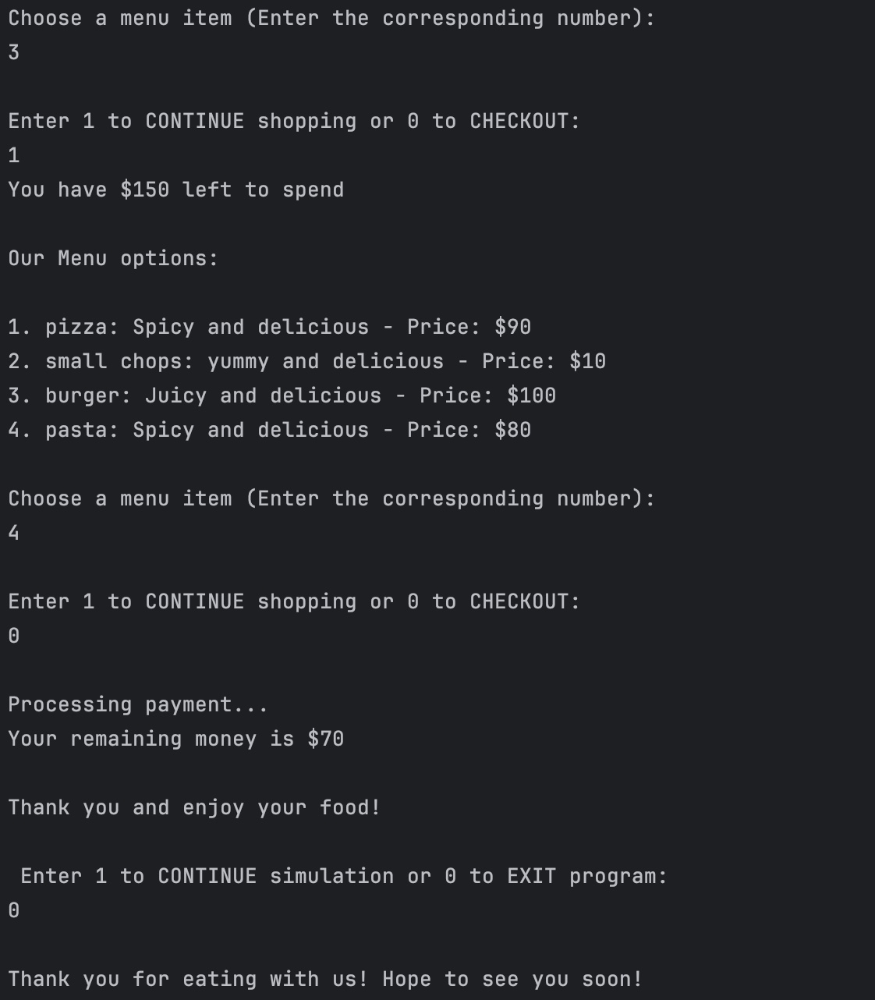

# Takeaway-Treats

## Overview

Takeaway-Treats is a Java-based simulation of a food ordering system. The project demonstrates key Java concepts such as Generics, Collections, Interfaces, and Functional Programming. Users can browse a menu, add food items to their shopping bag, and checkout based on their budget.

## Demo

Here is a demo of the Takeaway-Treats application:

## Features
+ Customer Management: Allows a customer to place an order with a predefined budget.
+ Food Menu: Displays a list of available food items.
+ Shopping Bag: Stores selected food items and calculates the total price.
+ Ordering Simulation: Guides the customer through selecting food and checking out.

## Concepts Used
+ Generics
+ Collections (List, Map)
+ Interfaces
+ Functional Interface
+ Object-Oriented Programming (OOP) Principles

## How to Run
### Prerequisites
####  Ensure that Java is installed on your system.
+ You can check this by running: 
java -version.
+ If Java is not installed, download and install it from Oracle or OpenJDK.

#### Getting the Project
* You can either clone the repository or download it manually.

#### Compilation & Execution
+ Open a terminal or command prompt.
+ Navigate to the directory where the Java files are stored.
+ Compile all Java files using:  javac *.java
+ Run the program using: java Main
+ Follow the on-screen prompts to:
  + Enter the customer name and available budget.
  + Select food items from the menu.
  + Proceed to checkout and confirm the order.

## Future Enhancements
+ Implement a database for storing food menu and customer history.
+ Add graphical user interface (GUI) for a better user experience.
+ Include discounts and offers in the pricing system.

